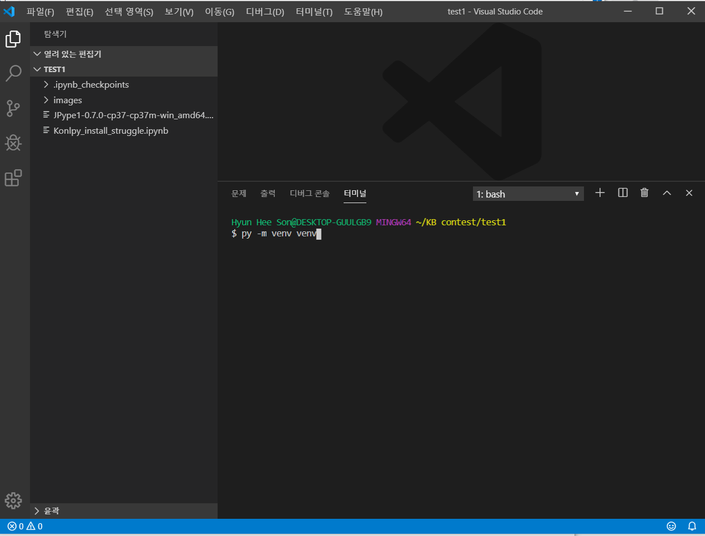

# Konlpy 설치

## Java 설치

https://java.com/ko/download/

## JDK 설치

1. 설치 사이트 singin and login

https://www.oracle.com/technetwork/java/javase/downloads/index.html

2. Java SE Development Kit 8 Downloads 선택

3. Accept License Agreement로 전환 후 맞는 Os 선택 후 다운

4. 다운 받은 파일을 작업할 폴더로 이동

5. Java 환경 설정

   cmd에서 jdk version 확인

   

   시스템 환경
   

   

   환경 변수 클릭

   

​	시스템 변수 내 새로 만들기

​	새 시스템의 변수 이름은 JAVA_HOME, 변수 값으로는 경로 
​	시스템의 변수 값에 C:\Program Files\Java\jdk{앞서 찾았던 version}

​	

​	다시 환경 변수 중 시스템 변수에서 Path를 선택

​	Path에서 새로 만들기로 %JAVA_HOME%\bin을 추가 후 반드시 맨 위로 올리기

​	다시 cmd에서 제대로 했는 지 version을 확인

​	

6. 작업 폴더로 가서 bash 열기

7. bash에서 아까 다운 받은 JPype 파일을 설치한다.
   

   
   

8. 설치가 완료되었다면 konlpy를 설치

   

9. 설치가 되었는 지 확인

   작업 폴더에 가상 환경 만들기

   

   환경 내 jupyter 설치

   

   jupyter notebook 실행

   

   konlpy 내 있는 함수를 사용하며 설치가 되었는 지 확인

   